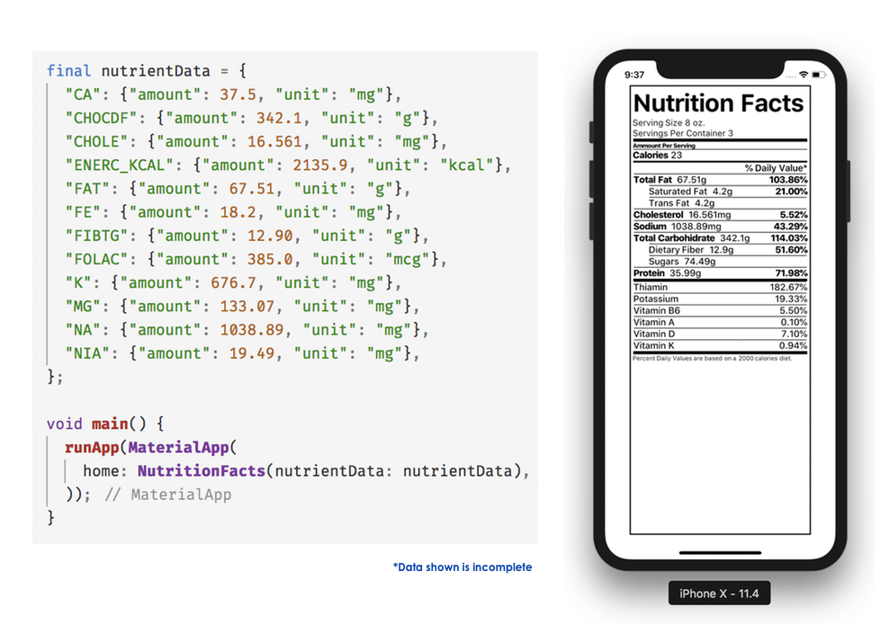

# nutrientfacts

Widget to render *Nutrition Facts* labels

# 

### Featuring:
- Full Nutrition Facts label rendering
- Automatic missing values handling
- Automatic Daily Value % calculation

## Getting Started

For help getting started with Flutter, view our online [documentation](https://flutter.io/).

For help on editing package code, view the [documentation](https://flutter.io/developing-packages/).
